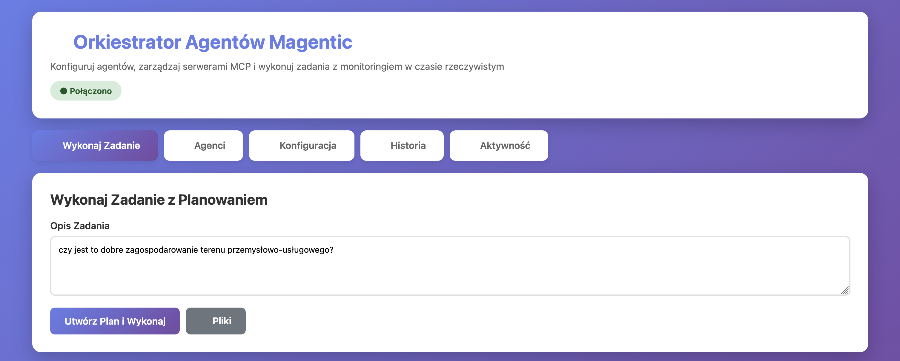

# Magentic Agent Orchestrator

A TypeScript multi-agent system implementing the **Magentic Orchestration Pattern** with Claude and Gemini agents.



## Features

- **Multi-Agent System**: Manager, Claude, and Gemini agents working together
- **Automatic Planning**: Break down complex tasks into executable steps
- **Cross-Agent Tools**: Claude can invoke Gemini for web search and summarization
- **MCP Support**: Connect Claude to Model Context Protocol servers
- **Web UI**: Full-featured interface for configuration and execution
- **Real-Time Updates**: Live task execution monitoring via WebSocket

## Quick Start

1. **Install dependencies:**
   ```bash
   npm install
   ```

2. **Configure API keys:**
   ```bash
   cp .env.example .env
   # Edit .env and add your API keys
   ```

3. **Start the Web UI:**
   ```bash
   npm run ui
   ```
   Then open [http://localhost:3001](http://localhost:3001)

See [UI_GUIDE.md](UI_GUIDE.md) for detailed usage instructions.

## Configuration

### API Keys

Edit `.env` and add your API keys:
```env
ANTHROPIC_API_KEY=your_claude_api_key_here
GOOGLE_API_KEY=your_gemini_api_key_here
```

### MCP Servers (Optional)

Configure Model Context Protocol servers in `.env`:
```env
MCP_SERVERS='[{"name":"filesystem","command":"npx","args":["-y","@modelcontextprotocol/server-filesystem","/tmp"]}]'
```

Or configure them through the Web UI Settings page.

## Usage

### Programmatic Usage

```typescript
import { MagenticOrchestrator } from './src/index.js';

const orchestrator = new MagenticOrchestrator({
  anthropicApiKey: process.env.ANTHROPIC_API_KEY!,
  googleApiKey: process.env.GOOGLE_API_KEY!,
});

await orchestrator.initialize();

// Execute task with automatic planning
const result = await orchestrator.executeTask(
  'Find the latest TypeScript features and create a summary',
  true
);

await orchestrator.cleanup();
```

See [examples/](examples/) for more usage examples.

## Architecture

The system uses three specialized agents:

1. **Manager Agent** - Plans tasks and delegates to appropriate agents
2. **Claude Agent** - Handles deep reasoning, code analysis, and complex tasks
3. **Gemini Agent** - Handles web search, summarization, and quick queries

Claude can invoke Gemini dynamically using cross-agent tool calling when it needs web search or summarization capabilities.

## Documentation

- [UI_GUIDE.md](UI_GUIDE.md) - Detailed Web UI guide
- [ARCHITECTURE.md](ARCHITECTURE.md) - System architecture details
- [examples/](examples/) - Code examples

## License

AGPL-3.0

## References

- [Magentic Orchestration Pattern](https://learn.microsoft.com/en-us/azure/architecture/ai-ml/guide/ai-agent-design-patterns#magentic-orchestration)
- [Model Context Protocol](https://modelcontextprotocol.io/)
- [Anthropic Claude API](https://docs.anthropic.com/)
- [Google Gemini API](https://ai.google.dev/)
